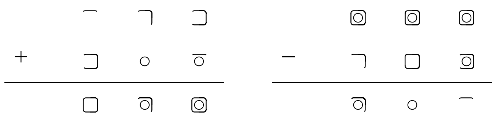

# Geong Mono (匠氏等宽)

一个基于 **JetBrains Mono** 深度定制的编程字体，集成了“匠氏数字”符号系统。
A programming font deeply customized based on **JetBrains Mono**, integrating the "Geong Numerals" symbol system.

---

## 📖 简介 | Introduction

**Geong Mono** 是对数字表达方式的一次实验性重构。
**Geong Mono** is an experimental reconstruction of numeral expression.

本字体保留了 JetBrains Mono 优秀的字母设计，但将数字 0 ~ 9 替换为基于几何拓扑与**二五混合进制（Bi-quinary logic）**设计的“匠氏数字”。
While preserving the excellent letter design of JetBrains Mono, this font replaces digits 0 ~ 9 with "Geong Numerals" based on geometric topology and **bi-quinary logic**.

这种设计旨在解决阿拉伯数字在视觉量感上的抽象性，使符号与其数值之间建立几何联系。
This design aims to resolve the abstract nature of Arabic numerals by establishing a geometric connection between symbols and their values.

---

## ✨ 特性 | Features

*   **直观的几何逻辑 | Intuitive Geometric Logic**: 数字 $1 \sim 4$ 由方框边数构成，$5$ 为中心圆，$6 \sim 9$ 则通过“圆+边”的组合实现视觉对仗。
    Digits $1 \sim 4$ consist of square edges, $5$ is a central circle, and $6 \sim 9$ achieve visual symmetry through "circle + edge" combinations.
*   **无需记忆的算术 | Visual Arithmetic**: 基于二五混合进制，加减法运算可以通过图形的叠加与拆解直观观察，无需死记硬背。
    Based on bi-quinary logic, addition and subtraction can be observed intuitively through the stacking and dismantling of shapes without rote memorization.
*   **开发者友好 | Developer Friendly**: 继承了 JetBrains Mono 的等宽特性，完美适配代码编辑器与 IDE。
    Inheriting the monospace characteristics of JetBrains Mono, it fits perfectly in code editors and IDEs.

---

## 🖼️ 预览 | Preview

### 1. 对照表 | Comparison Table
 

### 2. 视觉加法示例 | Visual Addition Example
通过图形组合，你可以直接“看到”运算结果：
Through graphic combination, you can directly "see" the calculation result:

---

## 🚀 如何使用 | How to Use

1.  **下载字体 | Download**: 前往 [Releases](../../releases) 下载最新的 `.ttf` 文件。
    Go to [Releases](../../releases) to download the latest `.ttf` files.
2.  **安装 | Install**: 在你的操作系统中安装该字体（Windows 右键安装，macOS 双击安装）。
    Install the font on your OS (Right-click to install on Windows, double-click on macOS).
3.  **编辑器配置 | IDE Setting**: 在 IDE 设置中，将 `Font Family` 设置为 `'Geong Mono'`。
    In your IDE settings, set the `Font Family` to `'Geong Mono'`.
4.  **查阅白皮书 | Read the Whitepaper**: 更多设计思路请参考项目内的 `白皮书-中文.pdf`。
    For more design philosophy, please refer to the `whitepaper-en.pdf` in the repository.

---

## 🤝 致谢 | Acknowledgements

本项目是基于开源项目 **[JetBrains Mono](https://github.com/JetBrains/JetBrainsMono)** 的衍生作品。
This project is a derivative work based on the open-source project **[JetBrains Mono](https://github.com/JetBrains/JetBrainsMono)**.

我们要向 **JetBrains** 团队表示由衷的感谢，感谢他们创造并分享了如此卓越的开发字体，为开源社区提供了坚实的基础。
We would like to express our sincere gratitude to the **JetBrains** team for creating and sharing such an outstanding developer typeface, providing a solid foundation for the open-source community.

---

## ⚖️ 协议 | License

*   **字体文件 | Font Files**: 遵循 [SIL Open Font License 1.1](LICENSE)。
    Licensed under the [SIL Open Font License 1.1](LICENSE).
*   **设计逻辑 | Design Logic**: 匠氏数字逻辑作为开源知识资产发布。
    The Geong Numerals logic is released as Open Knowledge Assets.
*   **版权声明 | Copyright**: JetBrains Mono 的版权归 JetBrains s.r.o 所有。
    Copyright of JetBrains Mono belongs to JetBrains s.r.o.

---
*Created by Mason Geong* 